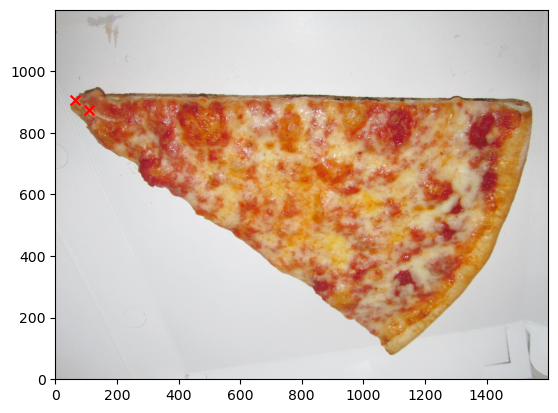
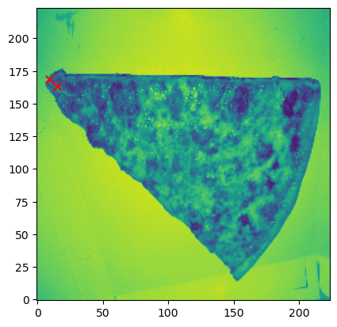
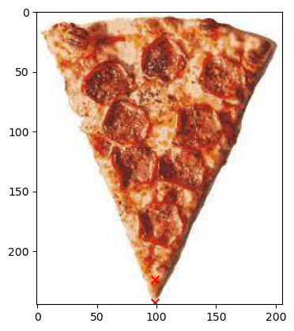
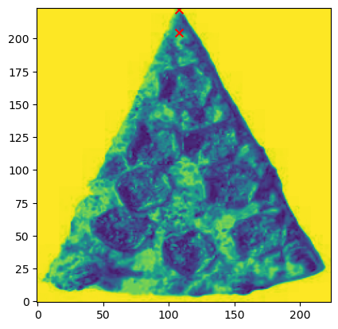
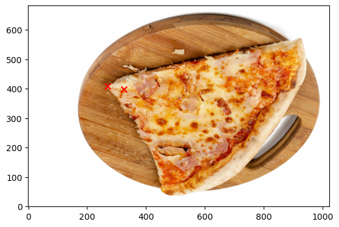
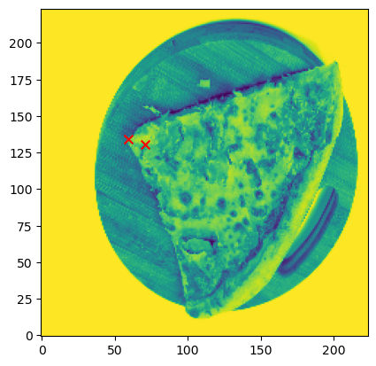
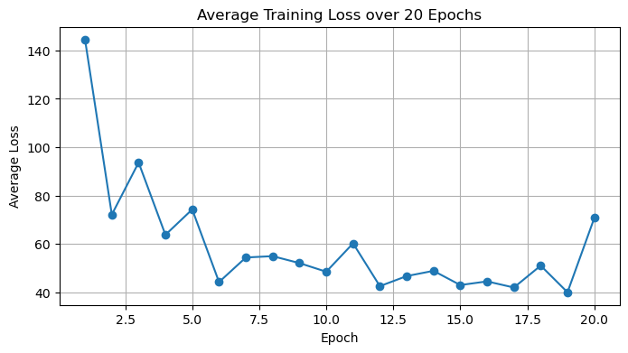
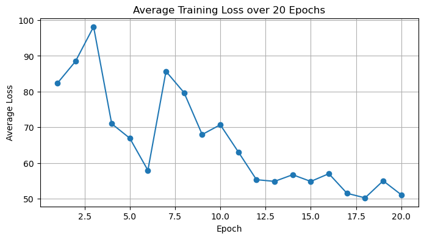
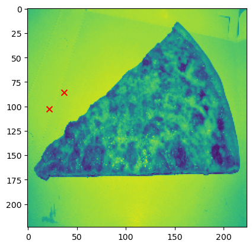
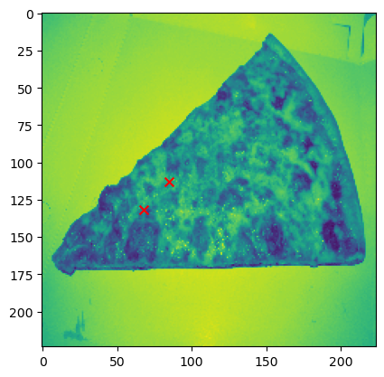

# Training a Pizza Slice Angle Detector


```python
## Define imports

## See 'dataloader.py' for custom dataloader class
from dataloader import create_data, PizzaDataset
## See 'model.py' for custom model class
from model import KeypointDetector
## See 'image_transforms.py' for custom image transforms
from image_transforms import *


## Some generic functions
from torchvision import transforms, utils
from torch.utils.data import DataLoader
import torch.nn as nn
import matplotlib.pyplot as plt
from torchvision.transforms import v2

```

    /home/sandippanesar/anaconda3/envs/llm_env/lib/python3.10/site-packages/torchvision/datapoints/__init__.py:12: UserWarning: The torchvision.datapoints and torchvision.transforms.v2 namespaces are still Beta. While we do not expect major breaking changes, some APIs may still change according to user feedback. Please submit any feedback you may have in this issue: https://github.com/pytorch/vision/issues/6753, and you can also check out https://github.com/pytorch/vision/issues/7319 to learn more about the APIs that we suspect might involve future changes. You can silence this warning by calling torchvision.disable_beta_transforms_warning().
      warnings.warn(_BETA_TRANSFORMS_WARNING)
    /home/sandippanesar/anaconda3/envs/llm_env/lib/python3.10/site-packages/torchvision/transforms/v2/__init__.py:54: UserWarning: The torchvision.datapoints and torchvision.transforms.v2 namespaces are still Beta. While we do not expect major breaking changes, some APIs may still change according to user feedback. Please submit any feedback you may have in this issue: https://github.com/pytorch/vision/issues/6753, and you can also check out https://github.com/pytorch/vision/issues/7319 to learn more about the APIs that we suspect might involve future changes. You can silence this warning by calling torchvision.disable_beta_transforms_warning().
      warnings.warn(_BETA_TRANSFORMS_WARNING)


## Load Data from SQL Database and Create Train-Test Split


```python
dl = create_data('./data/pizza_database.db','pizza_table')
train, valid = dl.split_data(0.8, ['index','data_path','x1','y1','x2','y2','other'])
```

## Define Image Transform Pipeline

Uses a combination of custom functions and those from the Torch library.

The rescale function also rescales the label coordinates.

NB: Due to time constraints, I decided to just normalize the image dimensions of each image. In some instances the aspect ratios are altered, which potentially causes a change in the angle of the pizza slice. Given more time, I would work on a solution to this. 


```python
transforms = v2.Compose([
    Rescale((224, 224)),
    Normalize(),
    v2.ToDtype(torch.float32),
])
```

## Transform Train Dataset

Create both transformed and untransformed datasets.

**Moving forward: x1,y1 is the tip and taken to be the origin point when calculating the angle relative to the vertical i.e. Y-axis**

The intention of both the data loader and the rest of this pipeline allows for **more training data to be added to the SQL database** so the model can be improved. 

Given more training data, batch size could be increased also. 


```python
untransformed_train_dataset = PizzaDataset(train, './data/images')
transformed_train_dataset = PizzaDataset(train, './data/images', transforms)

print(f'Size of Training Dataset: {len(train)}')

train
```

    Size of Training Dataset: 4


<div>
<style scoped>
    .dataframe tbody tr th:only-of-type {
        vertical-align: middle;
    }

    .dataframe tbody tr th {
        vertical-align: top;
    }

    .dataframe thead th {
        text-align: right;
    }
</style>
<table border="1" class="dataframe">
  <thead>
    <tr style="text-align: right;">
      <th></th>
      <th>index</th>
      <th>data_path</th>
      <th>x1</th>
      <th>y1</th>
      <th>x2</th>
      <th>y2</th>
      <th>other</th>
    </tr>
  </thead>
  <tbody>
    <tr>
      <th>0</th>
      <td>676378</td>
      <td>pizza0.jpg</td>
      <td>65</td>
      <td>905</td>
      <td>108</td>
      <td>875</td>
      <td>None</td>
    </tr>
    <tr>
      <th>1</th>
      <td>603024</td>
      <td>pizza1.jpg</td>
      <td>99</td>
      <td>243</td>
      <td>99</td>
      <td>224</td>
      <td>None</td>
    </tr>
    <tr>
      <th>2</th>
      <td>162132</td>
      <td>pizza4.jpg</td>
      <td>270</td>
      <td>409</td>
      <td>325</td>
      <td>399</td>
      <td>None</td>
    </tr>
    <tr>
      <th>3</th>
      <td>759454</td>
      <td>pizza2.jpg</td>
      <td>2694</td>
      <td>1586</td>
      <td>2544</td>
      <td>1484</td>
      <td>None</td>
    </tr>
  </tbody>
</table>
</div>


## Visualize Examples

NB: Note Y-axis is flipped when interpreting printed angle. 


```python
## Untransformed Image

eg0 = transformed_train_dataset.__getitem__(0)
eg0_u = untransformed_train_dataset.__getitem__(0)

dl.visualize_matrix_with_coordinates(eg0_u['image'], eg0_u['keypoints'])

print(f"Angle of slice: {dl.calculate_clockwise_angle(eg0['keypoints'])}")
```


    

    


    Angle of slice: 132.92996934695887


```python
## Transformed Image

dl.visualize_matrix_with_coordinates(eg0['image'],eg0['keypoints'])

print(f"Angle of slice: {dl.calculate_clockwise_angle(eg0_u['keypoints'])}")
```


    

    


    Angle of slice: 124.90249561592474


```python
## Untransformed Image

eg1 = transformed_train_dataset.__getitem__(1)
eg1_u = untransformed_train_dataset.__getitem__(1)

dl.visualize_matrix_with_coordinates(eg1_u['image'],eg1_u['keypoints'], flip_y=False)
print(f"Angle of slice: {dl.calculate_clockwise_angle(eg1['keypoints'])}")
```


    

    


    Angle of slice: 180.0


    /home/sandippanesar/Desktop/pizza/dataloader.py:123: RuntimeWarning: divide by zero encountered in double_scalars
      m = (points[3] - points[2]) / (points[1] - points[0])


```python
## Transformed Image

dl.visualize_matrix_with_coordinates(eg1['image'],eg1['keypoints'])
print(f"Angle of slice: {dl.calculate_clockwise_angle(eg1_u['keypoints'])}")
```


    

    


    Angle of slice: 180.0


```python
## Untransformed Image

eg2 = transformed_train_dataset.__getitem__(2)
eg2_u = untransformed_train_dataset.__getitem__(2)

dl.visualize_matrix_with_coordinates(eg2_u['image'],eg2_u['keypoints'])
print(f"Angle of slice: {dl.calculate_clockwise_angle(eg2['keypoints'])}")
```


    

    


    Angle of slice: 105.24802021373586


```python
## Transformed Image

dl.visualize_matrix_with_coordinates(eg2['image'],eg2['keypoints'])
print(f"Angle of slice: {dl.calculate_clockwise_angle(eg2['keypoints'])}")
```


    

    


    Angle of slice: 105.24802021373586


## Create DataLoader Class For Datasets


```python
train_loader = DataLoader(transformed_train_dataset, batch_size=1, shuffle=True)
transformed_test_dataset = PizzaDataset(valid, './data/images', transforms)
test_loader = DataLoader(transformed_test_dataset, batch_size=1, shuffle=True)
```

## Define Model Criteria For Training

L1Loss chosen specifically for keypoint detection task, over MSE or other loss functions. 

Has optional dropout layer.

Model 'KeypointDetector' contains: <br>
    - A convolutional layer <br>
    - A dropout layer <br>
    - A max pooling layer <br>
    - Another convolutional layer <br>
    - A dropout layer <br>
    - A fully connected layer <br>
    - Another fully connected layer which outputs an 1x4 array containing keypoint predictions [x1,x2,y1,y2]

Train model for 20 epochs. Might be overfit given size of training dataset. 


```python
criterion = nn.L1Loss()
# device = 'cuda:0'
device = 'cpu'
num_epochs = 20

## Define model with drouput
model = KeypointDetector(use_dropout=True)
model.to(device)
model = model.double()
optimizer = torch.optim.Adam(model.parameters(), lr=0.001)

## Define model without dropout
model2 = KeypointDetector(use_dropout=False)
model2.to(device)
model2 = model2.double()
optimizer2 = torch.optim.Adam(model2.parameters(), lr=0.001)
```

## Train Model w/o Dropout


```python
model.train_model(train_loader, criterion, optimizer, num_epochs, device)
```

    Epoch [1/20], Loss: 144.4762
    Epoch [2/20], Loss: 72.1675
    Epoch [3/20], Loss: 93.6804
    Epoch [4/20], Loss: 63.8277
    Epoch [5/20], Loss: 74.3124
    Epoch [6/20], Loss: 44.3223
    Epoch [7/20], Loss: 54.4706
    Epoch [8/20], Loss: 55.0200
    Epoch [9/20], Loss: 52.1544
    Epoch [10/20], Loss: 48.5876
    Epoch [11/20], Loss: 60.3026
    Epoch [12/20], Loss: 42.6375
    Epoch [13/20], Loss: 46.7932
    Epoch [14/20], Loss: 48.9535
    Epoch [15/20], Loss: 43.0898
    Epoch [16/20], Loss: 44.5996
    Epoch [17/20], Loss: 42.0674
    Epoch [18/20], Loss: 51.1178
    Epoch [19/20], Loss: 40.1112
    Epoch [20/20], Loss: 70.7763
    Finished Training


    

    


## Train Model w/ Dropout


```python
model2.train_model(train_loader, criterion, optimizer2, num_epochs, device)
```

    Epoch [1/20], Loss: 133.3856
    Epoch [2/20], Loss: 77.6829
    Epoch [3/20], Loss: 102.0402
    Epoch [4/20], Loss: 76.0591
    Epoch [5/20], Loss: 54.7393
    Epoch [6/20], Loss: 47.0420
    Epoch [7/20], Loss: 51.7843
    Epoch [8/20], Loss: 52.8233
    Epoch [9/20], Loss: 44.8576
    Epoch [10/20], Loss: 44.1067
    Epoch [11/20], Loss: 51.3694
    Epoch [12/20], Loss: 42.2044
    Epoch [13/20], Loss: 51.8401
    Epoch [14/20], Loss: 51.4077
    Epoch [15/20], Loss: 44.0286
    Epoch [16/20], Loss: 38.4707
    Epoch [17/20], Loss: 34.0659
    Epoch [18/20], Loss: 29.4441
    Epoch [19/20], Loss: 30.8783
    Epoch [20/20], Loss: 33.0962
    Finished Training


    

    


## Run Evaluation on Validation Set


```python
e1 = model.evaluate_model(model, test_loader, criterion, device)
e2 = model.evaluate_model(model2, test_loader, criterion, device)

print(f'Performance of first model on test dataset (average loss): {e1}')
print('-'*50)
print(f'Performance of second model on test dataset (average loss): {e2}')
```

    Performance of first model on test dataset (average loss): 44.73495858282969
    --------------------------------------------------
    Performance of second model on test dataset (average loss): 54.031345866847374


## Visualize the Predictions


```python
test_0 = transformed_test_dataset.__getitem__(0)
m1_preds = model.predict(model, test_0['image'])
m2_preds = model.predict(model2, test_0['image'])
```


```python
## Model 1

dl.visualize_matrix_with_coordinates(test_0['image'],m1_preds, flip_y=False)

print(f"Angle of slice: {dl.calculate_clockwise_angle(m1_preds)}")
```


    

    


    Angle of slice: 137.75217896963937


```python
## Model 2

dl.visualize_matrix_with_coordinates(test_0['image'],m2_preds, flip_y=False)

print(f"Angle of slice: {dl.calculate_clockwise_angle(m2_preds)}")
```


    

    


    Angle of slice: 138.44840610886317


## Conclusions

- Both models perform generally the same.
- On the test dataset the predicted angle is somewhat correct, despite the keypoints not being correct. 


## Improvements

- Larger training set.
- Devise another method to scale the images so that the angle is preserved despite the aspect ratio being tweaked. 
- Potentially exploring different model architectures, pretrained models e.g. ResNet-50 etc. 
