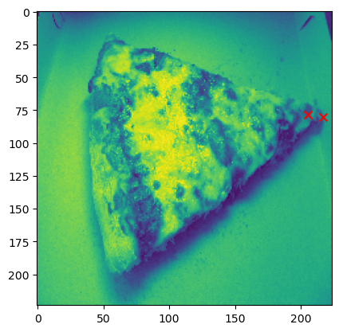
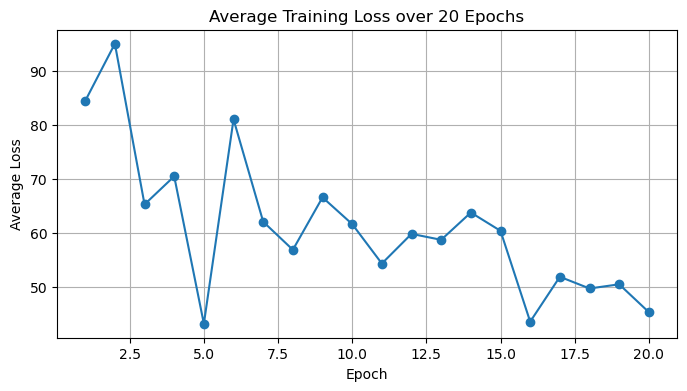
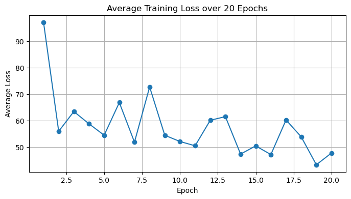

# Training a Pizza Slice Angle Detector

**Runnable notebook: `pizza_walkthrough.ipynb`**


```python
## Define imports

## Packages/environment contained in "requirements.yml"

## See 'dataloader.py' for custom dataloader class
from dataloader import create_data, PizzaDataset
## See 'model.py' for custom model class
from model import KeypointDetector
## See 'image_transforms.py' for custom image transforms
from image_transforms import *

## Some generic functions
from torchvision import transforms, utils
from torch.utils.data import DataLoader
import torch.nn as nn
import matplotlib.pyplot as plt
from torchvision.transforms import v2

```

    /home/sandippanesar/anaconda3/envs/llm_env/lib/python3.10/site-packages/torchvision/datapoints/__init__.py:12: UserWarning: The torchvision.datapoints and torchvision.transforms.v2 namespaces are still Beta. While we do not expect major breaking changes, some APIs may still change according to user feedback. Please submit any feedback you may have in this issue: https://github.com/pytorch/vision/issues/6753, and you can also check out https://github.com/pytorch/vision/issues/7319 to learn more about the APIs that we suspect might involve future changes. You can silence this warning by calling torchvision.disable_beta_transforms_warning().
      warnings.warn(_BETA_TRANSFORMS_WARNING)
    /home/sandippanesar/anaconda3/envs/llm_env/lib/python3.10/site-packages/torchvision/transforms/v2/__init__.py:54: UserWarning: The torchvision.datapoints and torchvision.transforms.v2 namespaces are still Beta. While we do not expect major breaking changes, some APIs may still change according to user feedback. Please submit any feedback you may have in this issue: https://github.com/pytorch/vision/issues/6753, and you can also check out https://github.com/pytorch/vision/issues/7319 to learn more about the APIs that we suspect might involve future changes. You can silence this warning by calling torchvision.disable_beta_transforms_warning().
      warnings.warn(_BETA_TRANSFORMS_WARNING)


## Load Data from SQL Database and Create Train-Test Split

The split function contains a seed method to randomly and deterministically split the data.


```python
dl = create_data('./data/pizza_database.db','pizza_table')
train, valid = dl.split_data(0.8, ['index','data_path','x1','y1','x2','y2','other'])
```

## Define Image Transform Pipeline

Uses a combination of custom functions and those from the Torch library.

The rescale function also rescales the label coordinates.

NB: Due to time constraints, I decided to just normalize the image dimensions of each image. In some instances the aspect ratios are altered, which potentially causes a change in the angle of the pizza slice. 

To account for the change in angle that comes with the aspect ratios, once the predictions have been made by the trained model, the prediction coordinates are then transformed back to the coordinate space of the original image, which reflects the 'true' angle.

Inference can be run on the normalized data, and there is a function in the dataloader class ('transform_pred_to_normal') which rescales the keypoints back to the original height and width of the image before pre-processing.


```python
transforms = v2.Compose([
    Rescale((224, 224)),
    Normalize(),
    v2.ToDtype(torch.float32),
])
```

## Transform Train Dataset

Create both transformed and untransformed datasets.

**Moving forward: x1,y1 is the tip and taken to be the origin point when calculating the angle relative to the vertical i.e. Y-axis**

The intention of both the data loader and the rest of this pipeline allows for **more training data to be added to the SQL database** so the model can be improved. 

Given more training data, batch size could be increased also. 


```python
untransformed_train_dataset = PizzaDataset(train, './data/images')
transformed_train_dataset = PizzaDataset(train, './data/images', transforms)

print(f'Size of Training Dataset: {len(train)}')

train
```

    Size of Training Dataset: 4


<div>
<style scoped>
    .dataframe tbody tr th:only-of-type {
        vertical-align: middle;
    }

    .dataframe tbody tr th {
        vertical-align: top;
    }

    .dataframe thead th {
        text-align: right;
    }
</style>
<table border="1" class="dataframe">
  <thead>
    <tr style="text-align: right;">
      <th></th>
      <th>index</th>
      <th>data_path</th>
      <th>x1</th>
      <th>y1</th>
      <th>x2</th>
      <th>y2</th>
      <th>other</th>
    </tr>
  </thead>
  <tbody>
    <tr>
      <th>0</th>
      <td>676378</td>
      <td>pizza0.jpg</td>
      <td>65</td>
      <td>905</td>
      <td>108</td>
      <td>875</td>
      <td>None</td>
    </tr>
    <tr>
      <th>1</th>
      <td>603024</td>
      <td>pizza1.jpg</td>
      <td>99</td>
      <td>243</td>
      <td>99</td>
      <td>224</td>
      <td>None</td>
    </tr>
    <tr>
      <th>2</th>
      <td>893981</td>
      <td>pizza3.jpg</td>
      <td>1547</td>
      <td>430</td>
      <td>1466</td>
      <td>420</td>
      <td>None</td>
    </tr>
    <tr>
      <th>3</th>
      <td>162132</td>
      <td>pizza4.jpg</td>
      <td>270</td>
      <td>409</td>
      <td>325</td>
      <td>399</td>
      <td>None</td>
    </tr>
  </tbody>
</table>
</div>


## Visualize Examples

NB: Note Y-axis is flipped when interpreting printed angle. 


```python
## Untransformed Image

eg0 = transformed_train_dataset.__getitem__(0)
eg0_u = untransformed_train_dataset.__getitem__(0)

dl.visualize_matrix_with_coordinates(eg0_u['image'], eg0_u['keypoints'], flip_y=False)

print(f"Angle of slice: {dl.calculate_clockwise_angle(eg0['keypoints'])}")
```


    

    


    Angle of slice: 132.92996934695887


```python
## Transformed Image

dl.visualize_matrix_with_coordinates(eg0['image'],eg0['keypoints'], flip_y=False)

print(f"Angle of slice: {dl.calculate_clockwise_angle(eg0_u['keypoints'])}")
```


    

    


    Angle of slice: 124.90249561592474


```python
## Untransformed Image

eg1 = transformed_train_dataset.__getitem__(1)
eg1_u = untransformed_train_dataset.__getitem__(1)

dl.visualize_matrix_with_coordinates(eg1_u['image'],eg1_u['keypoints'], flip_y=False)
print(f"Angle of slice: {dl.calculate_clockwise_angle(eg1['keypoints'])}")
```


    

    


    Angle of slice: 180.0


    /home/sandippanesar/Desktop/pizza_angle_prediction/dataloader.py:182: RuntimeWarning: divide by zero encountered in double_scalars
      m = (points[3] - points[2]) / (points[1] - points[0])


```python
## Transformed Image

dl.visualize_matrix_with_coordinates(eg1['image'],eg1['keypoints'], flip_y=False)
print(f"Angle of slice: {dl.calculate_clockwise_angle(eg1_u['keypoints'])}")
```


    

    


    Angle of slice: 180.0


```python
## Untransformed Image

eg2 = transformed_train_dataset.__getitem__(2)
eg2_u = untransformed_train_dataset.__getitem__(2)

dl.visualize_matrix_with_coordinates(eg2_u['image'],eg2_u['keypoints'], flip_y=False)
print(f"Angle of slice: {dl.calculate_clockwise_angle(eg2['keypoints'])}")
```


    

    


    Angle of slice: 80.6524221903351


```python
## Transformed Image

dl.visualize_matrix_with_coordinates(eg2['image'],eg2['keypoints'], flip_y=False)
print(f"Angle of slice: {dl.calculate_clockwise_angle(eg2['keypoints'])}")
```


    

    


    Angle of slice: 80.6524221903351


## Create DataLoader Class For Datasets


```python
train_loader = DataLoader(transformed_train_dataset, batch_size=1, shuffle=True)
untransformed_test_dataset = PizzaDataset(valid, './data/images')
transformed_test_dataset = PizzaDataset(valid, './data/images', transforms)
test_loader = DataLoader(transformed_test_dataset, batch_size=1, shuffle=True)
```

## Define Model Criteria For Training

L1Loss chosen specifically for keypoint detection task, over MSE or other loss functions. 

Has optional dropout layer.

Model 'KeypointDetector' contains: <br>
    - A convolutional layer <br>
    - A dropout layer <br>
    - A max pooling layer <br>
    - Another convolutional layer <br>
    - A dropout layer <br>
    - A fully connected layer <br>
    - Another fully connected layer which outputs an 1x4 array containing keypoint predictions [x1,x2,y1,y2]

Train model for 20 epochs. Might be overfit given size of training dataset. 


```python
criterion = nn.L1Loss()
# device = 'cuda:0' ## If you have large enough GPU can uncomment this
device = 'cpu'
num_epochs = 20

## Define model with drouput
model = KeypointDetector(use_dropout=True)
model.to(device)
model = model.double()
optimizer = torch.optim.Adam(model.parameters(), lr=0.001)

## Define model without dropout
model2 = KeypointDetector(use_dropout=False)
model2.to(device)
model2 = model2.double()
optimizer2 = torch.optim.Adam(model2.parameters(), lr=0.001)
```

## Train Model w/o Dropout


```python
model.train_model(train_loader, criterion, optimizer, num_epochs, device)
```

    Epoch [1/20], Loss: 84.4678
    Epoch [2/20], Loss: 95.0840
    Epoch [3/20], Loss: 65.2747
    Epoch [4/20], Loss: 70.4862
    Epoch [5/20], Loss: 43.1412
    Epoch [6/20], Loss: 81.0602
    Epoch [7/20], Loss: 62.0612
    Epoch [8/20], Loss: 56.8554
    Epoch [9/20], Loss: 66.5791
    Epoch [10/20], Loss: 61.6216
    Epoch [11/20], Loss: 54.3033
    Epoch [12/20], Loss: 59.8105
    Epoch [13/20], Loss: 58.7050
    Epoch [14/20], Loss: 63.7697
    Epoch [15/20], Loss: 60.3706
    Epoch [16/20], Loss: 43.5193
    Epoch [17/20], Loss: 51.8487
    Epoch [18/20], Loss: 49.6787
    Epoch [19/20], Loss: 50.4530
    Epoch [20/20], Loss: 45.2872
    Finished Training


    

    


## Train Model w/ Dropout


```python
model2.train_model(train_loader, criterion, optimizer2, num_epochs, device)
```

    Epoch [1/20], Loss: 97.0534
    Epoch [2/20], Loss: 55.9691
    Epoch [3/20], Loss: 63.4243
    Epoch [4/20], Loss: 58.8003
    Epoch [5/20], Loss: 54.4927
    Epoch [6/20], Loss: 66.8074
    Epoch [7/20], Loss: 51.8898
    Epoch [8/20], Loss: 72.6757
    Epoch [9/20], Loss: 54.4850
    Epoch [10/20], Loss: 52.1390
    Epoch [11/20], Loss: 50.5206
    Epoch [12/20], Loss: 60.1279
    Epoch [13/20], Loss: 61.5077
    Epoch [14/20], Loss: 47.3993
    Epoch [15/20], Loss: 50.4702
    Epoch [16/20], Loss: 47.2189
    Epoch [17/20], Loss: 60.2534
    Epoch [18/20], Loss: 53.8989
    Epoch [19/20], Loss: 43.3720
    Epoch [20/20], Loss: 47.8063
    Finished Training


    

    


## Run Evaluation on Validation Set


```python
e1 = model.evaluate_model(model, test_loader, criterion, device)
e2 = model.evaluate_model(model2, test_loader, criterion, device)

print(f'Performance of first model on test dataset (average loss): {e1}')
print('-'*50)
print(f'Performance of second model on test dataset (average loss): {e2}')
```

    Performance of first model on test dataset (average loss): 74.98613491133673
    --------------------------------------------------
    Performance of second model on test dataset (average loss): 103.807837380934


## Visualize the Predictions on Untransformed Validation Data


```python
test_0 = transformed_test_dataset.__getitem__(0)
m1_preds = model.predict(model, test_0['image'])
m2_preds = model.predict(model2, test_0['image'])

m1_preds_rescaled = dl.transform_pred_to_normal(m1_preds, (224,224), untransformed_test_dataset.__getitem__(0)['image'])
m2_preds_rescaled = dl.transform_pred_to_normal(m2_preds, (224,224), untransformed_test_dataset.__getitem__(0)['image'])
```


```python
## Model 1

dl.visualize_matrix_with_coordinates(untransformed_test_dataset.__getitem__(0)['image'], m1_preds_rescaled, flip_y=False)

print(f"Angle of slice: {dl.calculate_clockwise_angle(m1_preds_rescaled)}")
```


    

    


    Angle of slice: 140.22932220776502


```python
## Model 2

dl.visualize_matrix_with_coordinates(untransformed_test_dataset.__getitem__(0)['image'], m2_preds_rescaled, flip_y=False)

print(f"Angle of slice: {dl.calculate_clockwise_angle(m2_preds_rescaled)}")
```


    

    


    Angle of slice: 85.51200167739077


## Conclusions

- Metrics wise, the model without dropout performs better.
- Despite a very limited training sample, a neural network with a keypoint prediction layer can be successfully trained.
- On the test dataset the predicted angle for the second image is somewhat correct, despite the keypoints not being correct. 

## Improvements

- Larger training set. 
- Potentially exploring different model architectures, pretrained models e.g. ResNet-50 etc. 
