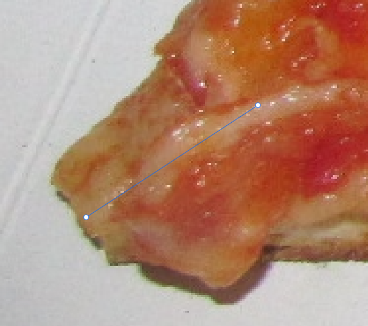

In this take home assignment, we'd like you to show off your technical abilities. We are looking for coding style as well as correctness. You are free to use any tools to help you, such as Google, Stack Overflow, and even ChatGPT. Our only requirements are that you code the solution yourself without talking to anyone else.

Good luck!

# Pizza Robot

You work for a company that creates robots to make pizza. The robot works by making the pizza, cutting the pizza into slices, and sending those slices along a conveyor belt to be packaged.

However, there’s a new problem with the robot. Sometimes, the slices of pizza are placed at an incorrect angle on the conveyor belt. This is a problem because the slice packaging can only work when the slices are straight.

Your task is to train a neural network that takes as input an image of a slice of pizza, and predicts the angle of the pizza.

We have provided you with a (very small) dataset. The dataset contains images, as well as labels in a [SQLite database](https://docs.python.org/3/library/sqlite3.html). The labels contain two items: the pizza tip, and the behind-pizza tip; these two points define a vector that indicates the angle of the pizza. Below is an example image:

Your goal is to successfully train this neural network. We are being intentionally vague about what “success” means. It is your job to prove to us that your implementation is correct.

Below is a list of requirements regarding your implementation:

- Include a README explaining how to run your code
- Use Python 3.7+
- Use either Tensorflow or PyTorch
- Use a SQL query against the labels database to randomly and deterministically split the dataset into a training and validation set
- Your implementation should be general enough such that if more data was added, your code would still work
- In order to make this problem more tractable and not take up too much of your time, focus solely on performance on the training set. Your code should still include the validation set, but we will not judge your performance on the validation set.
- In the README, briefly describe 2 things you would implement to improve performance on the validation set
- Include comments in your code to explain relevant major design decisions
